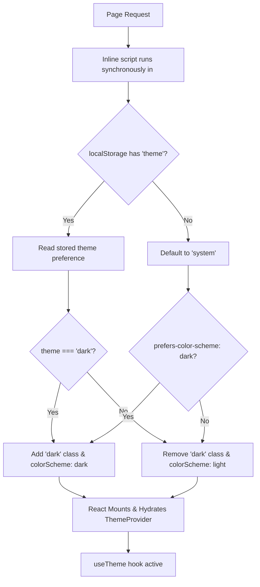

# Dark Mode Persistence & System Preference Detection

This document outlines the implementation details and usage of the robust dark mode persistence system implemented in DraftDeckAI.

## Overview
Previously, the dark mode state would reset upon page refreshing, causing a disruptive user experience. The newly implemented system:
1. **Persists preference** in `localStorage` securely.
2. **Detects & respects system preferences** (`prefers-color-scheme`) on a user's first visit.
3. **Completely eliminates unstyled theme flash (FOUC)** using an inline blocking script.
4. **Abstracts logic** inside a clean, reusable React hook (`useTheme`).

---

## Technical Architecture



---

## 🛠️ The Reusable `useTheme` Hook
The logic is fully abstracted under `hooks/use-theme.ts` for clean reusability across all UI toggles, settings page, and other layout components:

```typescript
import { useTheme } from '@/hooks/use-theme';

function MyComponent() {
  const { 
    theme,             // 'light' | 'dark' | 'system'
    resolvedTheme,     // 'light' | 'dark'
    isDark,            // boolean
    isLight,           // boolean
    isUsingSystemTheme,// boolean
    systemPreference,  // 'light' | 'dark' (independent of choice)
    toggleTheme,       // quick toggle function
    setTheme,          // set specific theme ('light' | 'dark' | 'system')
    mounted            // hydration safety flag
  } = useTheme();
  
  if (!mounted) return <Skeleton />;
  
  return (
    <button onClick={toggleTheme}>
      Switch to {isDark ? 'light' : 'dark'}
    </button>
  );
}
```

---

## ⚡ Prevention of Unstyled Flash (FOUC)
Without server-side rendering knowledge of client preferences, a user in dark mode would normally experience a jarring "white flash" before hydration. To solve this, a small, highly optimized synchronous script is placed inside `app/layout.tsx`'s `<head>`:

```html
<script
  dangerouslySetInnerHTML={{
    __html: `
      (function() {
        try {
          var stored = localStorage.getItem('theme');
          var prefersDark = window.matchMedia('(prefers-color-scheme: dark)').matches;
          var theme = stored || 'system';
          var isDark = theme === 'dark' || (theme === 'system' && prefersDark);
          document.documentElement.classList.toggle('dark', isDark);
          document.documentElement.style.colorScheme = isDark ? 'dark' : 'light';
        } catch (e) {}
      })();
    `,
  }}
/>
```

---

## 🎛️ Settings Page Integration
The Settings page (`app/settings/page.tsx`) offers deep configuration options matching standard professional platforms:
- Choose explicitly between **Light**, **Dark**, or **System**.
- Shows system-preference indicators and notices confirming automatic saving of preferences.
- Seamlessly updates the application state in real-time.

---

## 🚀 Verifying and Testing
1. **Clear LocalStorage**: Run `localStorage.clear()` in the browser developer console.
2. **Reload**: Verify that the theme matches your browser/operating system's dark/light mode preference.
3. **Change OS Theme**: With the theme set to `system` in Settings, toggle your OS dark/light setting and verify the app updates in real-time without reloading.
4. **Hard Reload**: Toggle to Dark mode, hit `Ctrl + F5` (or `Cmd + Shift + R`), and verify there is **zero flicker**.
